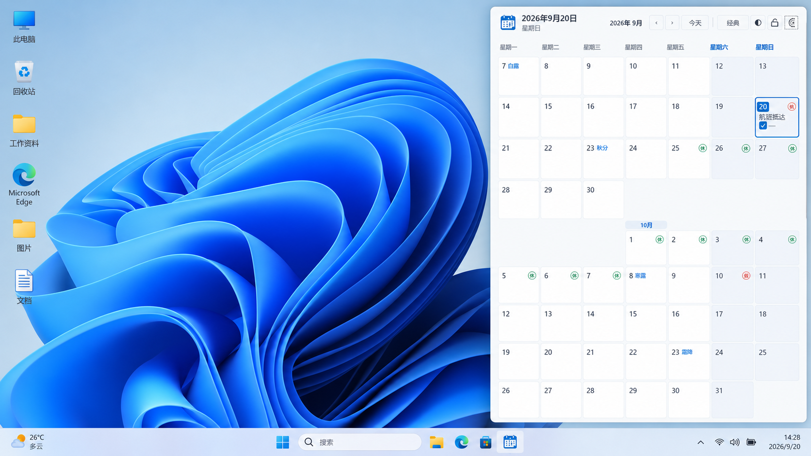
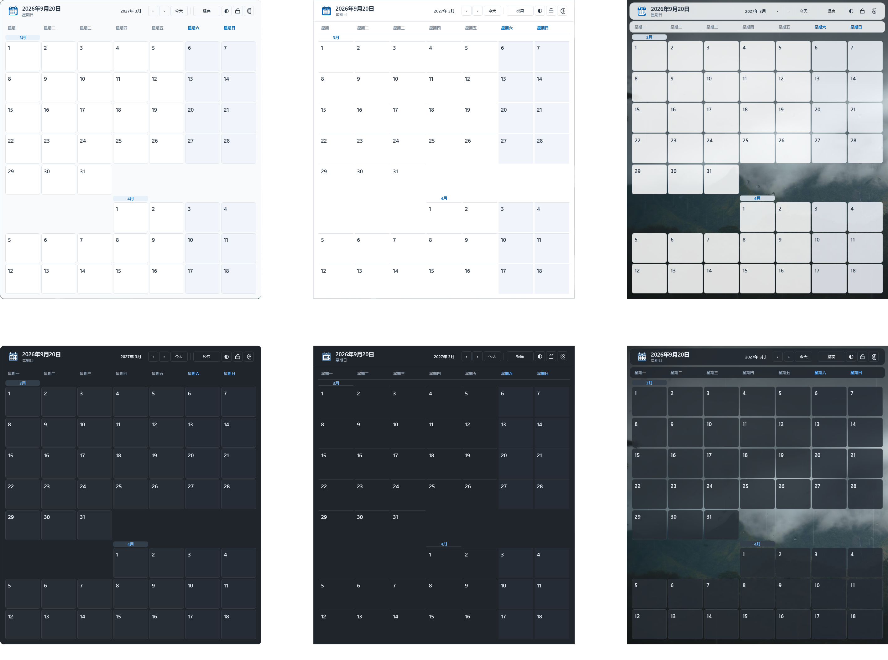
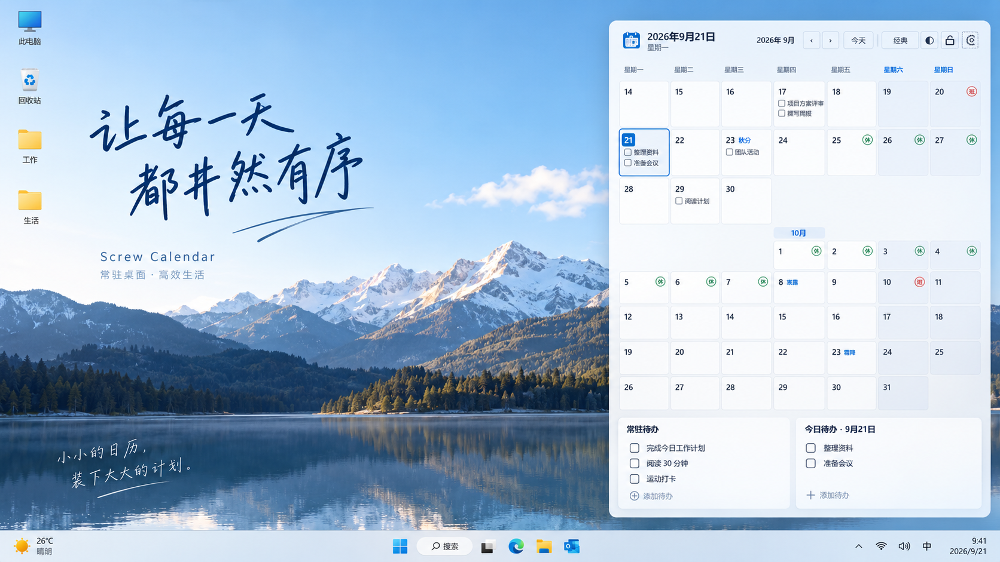

# Screw Calendar

> 让每一天都井然有序。

[English](README.md) · 简体中文

[](https://github.com/Qionline/Screw-Calendar/actions/workflows/build.yml)
[](LICENSE)

Screw Calendar 是一个面向 Windows 10/11 的桌面日历与本机 Markdown 待办工具。它把日历、节假日和待办放在桌面上，支持置顶、托盘管理、多种样式与本地数据备份。

## 预览

### 日历模式

日历组件可以作为桌面挂件运行，随时查看日期、节气、节假日和当天安排。



### 样式与主题

支持经典、极简和紧凑三种样式，以及浅色、深色和多种主题色组合。



### 待办模式

常驻待办和按日期保存的 Markdown 待办可以与日历同时显示，让计划始终保持在手边。



## 设计理念

Screw Calendar 不试图成为复杂的项目管理工具，而是把日期、节假日和手头待办直接放在桌面上，让信息始终可见、操作保持简单。

- **本地优先**：日历和待办内容保存在本机，不依赖账号或云同步。
- **低干扰**：需要时查看和编辑，不需要时让出桌面空间。
- **贴合 Windows**：通过托盘、置顶、开机启动和多显示器位置恢复融入日常桌面。
- **可恢复**：支持自动备份、损坏恢复和 JSON 导入导出。

用户的日历内容始终保存在本机；联网仅用于获取公开的节假日数据，并支持缓存和内置数据回退。

## 核心特性

### 日历

- 星期一至星期日的七列月历布局，支持 5～10 行日期显示。
- 支持按月翻页和快速回到今天。
- 今天高亮、周末区分、二十四节气，以及中国法定节假日和调休标记。
- 节假日数据支持后台更新、缓存和离线回退。

### Markdown 待办

- 常驻待办和按日期保存的 Markdown 待办。
- 可视化块编辑器，支持标题、列表和任务列表。
- 支持粘贴或拖入图片，并归档到本机资源目录。
- Markdown 内容支持 JSON 导入导出，方便备份和迁移。

### 桌面体验

- 经典、极简和紧凑三种视觉样式。
- 浅色 / 深色模式、多种主题色和透明度调节。
- 始终置顶或位于普通窗口下方。
- 系统托盘、开机启动、位置和大小锁定。
- 多显示器位置恢复和单实例运行。
- 简体中文和英文界面。

### 本机数据

- 日历和待办内容不上传、不做云同步。
- 主文件自动备份，数据损坏时尝试从备份恢复。
- 图片按内容归档到本机 `assets` 目录，删除原始图片不会影响已保存的待办图片。

## 下载与运行

从 [GitHub Releases](https://github.com/Qionline/Screw-Calendar/releases) 下载 ZIP 压缩包，解压后运行 `ScrewCalendar.exe` 即可。随附的 `.sha256` 文件为可选校验文件，用于验证下载完整性以及压缩包内容是否与发布文件一致。

当前发布包支持 Windows 10/11 x64，无需额外安装 .NET Runtime。

用户数据保存在 `%LocalAppData%\ScrewCalendar`，替换程序目录或升级版本不会删除已有数据。首次运行未经代码签名的开源程序时，Windows 可能会显示安全提示，请确认文件来自 GitHub Releases。

## 数据与隐私

程序不会同步或上传日历内容。程序会从 [`holiday-cn`](https://github.com/NateScarlet/holiday-cn) 获取公开的节假日 JSON，并在启动或翻页时检查当前查看年份及下一年的数据。成功缓存后 24 小时内不重复下载，网络不可用时自动使用缓存或内置数据。

数据保存在：

```text
%LocalAppData%\ScrewCalendar\
├─ data\calendar.json
├─ data\calendar.json.bak
├─ data\assets\
├─ data\holiday-cache\
└─ logs\app.log
```

JSON 导出不包含 `assets` 中的图片。跨电脑迁移包含图片的待办时，需要同时复制 `assets` 文件夹。完整步骤请阅读[用户指南](docs/USER_GUIDE.md)。

## 文档

- [用户指南](docs/USER_GUIDE.md)：下载、首次启动、日历、待办、数据迁移和常见操作。
- [开发文档](docs/DEVELOPMENT.md)：项目结构、数据规则、UI 约束和代码规范。
- [发布指南](docs/RELEASING.md)：版本、标签、构建和 GitHub Release 流程。
- [贡献指南](CONTRIBUTING.md)：提交修改、测试和合并要求。
- [安全策略](SECURITY.md)：安全问题的报告方式。
- [第三方声明](THIRD_PARTY_NOTICES.md)：依赖、数据来源和视觉资产说明。

## 从源码构建

安装不低于 [global.json](global.json) 基线版本的 .NET 8 SDK，然后在项目根目录运行：

```powershell
dotnet restore .\ScrewCalendar.sln --configfile .\NuGet.Config --locked-mode
dotnet run --project .\tests\ScrewCalendar.Tests\ScrewCalendar.Tests.csproj -c Release --no-restore
dotnet format .\ScrewCalendar.sln --verify-no-changes --no-restore
dotnet build .\ScrewCalendar.csproj -c Release --no-restore
```

完整架构、开发规范和发布步骤见[开发文档](docs/DEVELOPMENT.md)与[发布指南](docs/RELEASING.md)。

## 参与贡献

提交修改前请阅读[贡献指南](CONTRIBUTING.md)、[社区行为准则](CODE_OF_CONDUCT.md)和 [UI 样式契约](UI_STYLE_CONTRACT.md)。安全问题请按照[安全策略](SECURITY.md)私下报告。

## 许可证

Copyright © 2026 Qionline。

本项目采用 [GNU General Public License v3.0 or later](LICENSE)。第三方软件、数据及视觉资产声明见 [THIRD_PARTY_NOTICES.md](THIRD_PARTY_NOTICES.md)。
